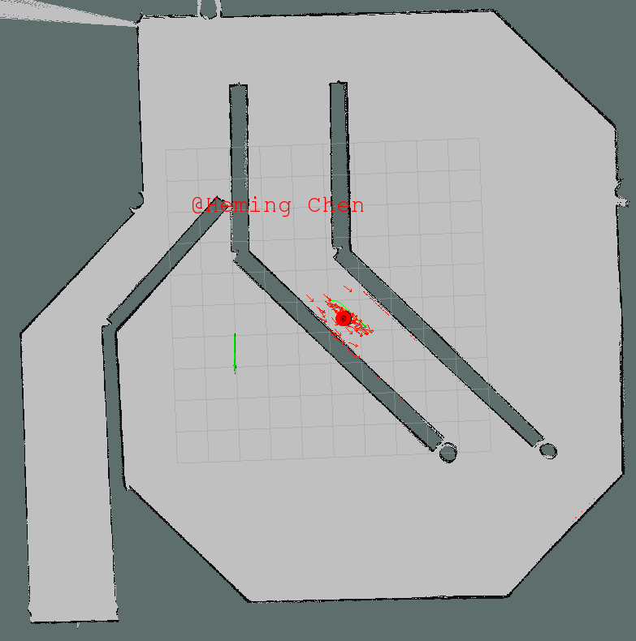
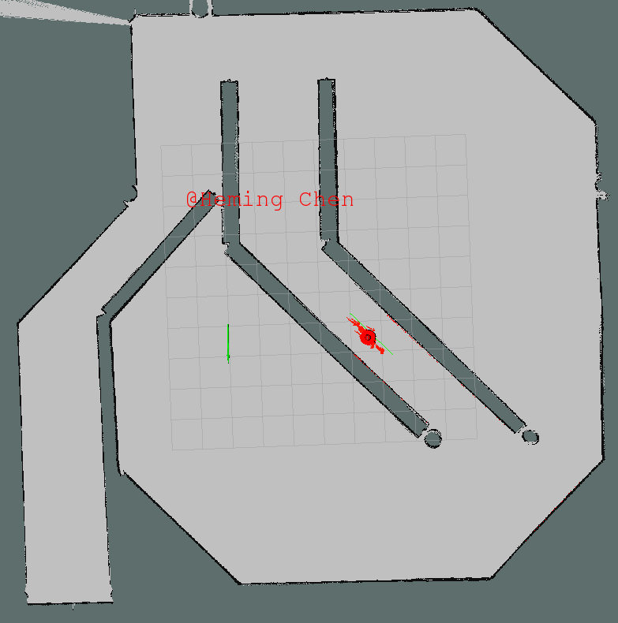
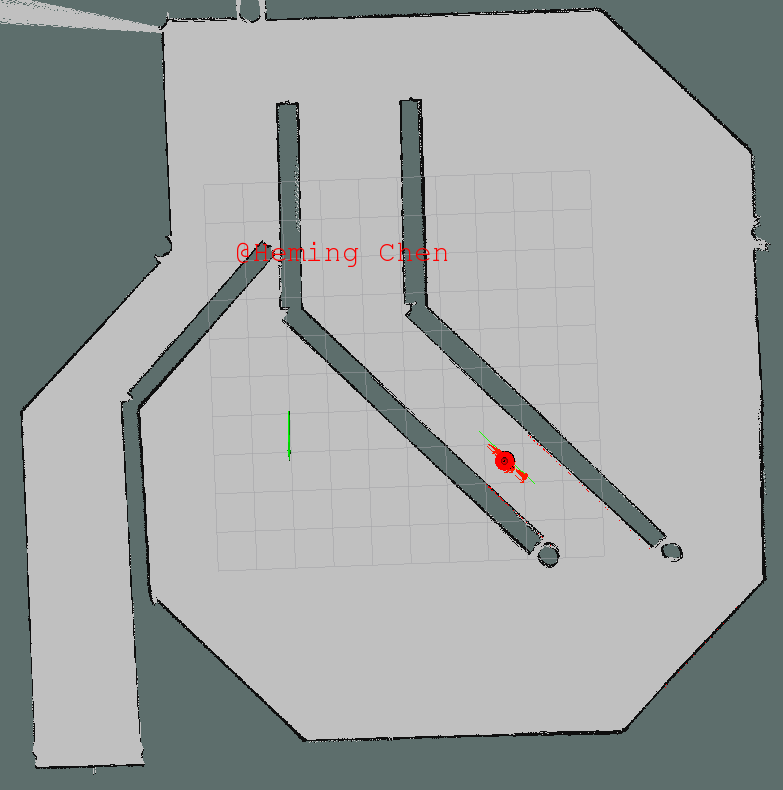
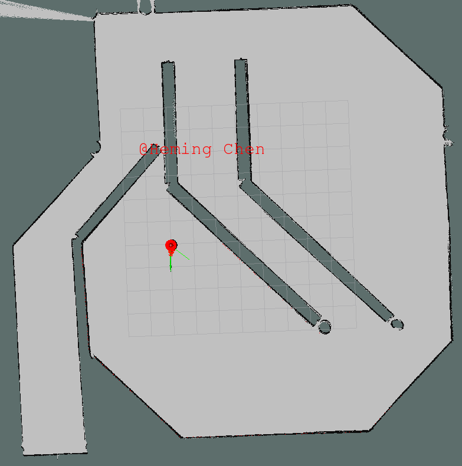

[](https://www.udacity.com/robotics)


# Robotic Localization Project

## Abstract
The goal of this project is to localize the robot in a map with obstacles using ROS AMCL package (Adaptive Monte-Carlo Localization) and help drive it to destination using the `differential_drive_controller` plugin. 

To accomplish it, I first tuned the path planner parameters and ensure the default Udacity bot can drive itself to any destination on the given map. I then started changing the robot design to a sweep robot with a cylinder shape chassis and a dome to mount the laser scanner. In the end, I fine tune the path planner parameters and robot model to ensure the new custom robot can work as well as the Udacity bot.

The model contained in this repository is the final version of my custom robot.


## Introduction
In robotics and other fields related to automatically vehicle control, localization is a critical part of the Navigation-Guidance-Control cycle. In order to start driving a vehicle to destination, we first need to know where it is - called navigation/localization. Otherwise the vehicle may move towards random locations other than the target and even run into obstacles. Upon knowing the location of the vehicle, we can calculate a path guiding the vehicle from current location to destination - called guidance. The path must be valid, meaning the vehicle must be able to physically achieve it (no 90-degree turn, no sharp acceleration unable to achieve by vehicle, etc.) and not hit obstacles. Once the path is calculated, the next task is to control the vehicle to move along the planned path. In many cases, due to computing load, changing environment and other factors, this process is executed iteratively as opposed to a one time job. 

In this project, we will be working on all three tasks: localize the robot, generate a global and local path and eventually drive it to the destination, with the help of off-the-shelf ROS packages. The main focus however is the localization part.


## Background
In the area of localization, common methods include Kalman Filter (including EKF, Unscented KF, etc.) and Particle Filter.

The Kalman filter is an estimation algorithm that can provide sufficiently accurate location of an object using sensor readings from multiple sources. While the vanilla Kalman Filter can work with linear systems, Extended Kalman Filter and Unscented Kalman Filter are more accurate for nonlinear system, which is more common in real-world. They can provide fairly fast updates and hence are used in many real-time systems.
 
Particle filter on the other hand is a probabilistic based method and does not use complex mathematically linear/nonlinear equations. Unlike Kalman Filter, its performance can be easily tuned according to the computing power of the system by adjusting the number of particles used in localization, which can be a great advantage in complex scenarios.

In this project, Adaptive Monte-Carlo Localization - adjusting the number of particles as needed is used with the help of the `amcl` package in ROS. 

The map used in this project is shown below, where the robot needs to move with the presents of barriers. 


## Results
A screenshot of the custom robot is given below. It has a cylinder-shape chassis with a dome on top. The camera is mounted on front of the cylinder chassis and the laser scanner is installed on the top of the dome. It has two wheels in the middle section of the chassis and two casters - one in front and one in the back, to maintain balance.


The next series of screenshots shows how the robot moves to destination.












As seen in above screenshots, the robot was able to go around all obstacles and reach the final destination with anticipated orientation.


## Model Configuration

### Robot Configuration
As mentioned before, the custom robot has a cylinder-shape chassis with a dome on top. The camera is mounted on front of the cylinder chassis and the laser scanner is installed on the top of the dome. It has two wheels in the middle section of the chassis and two casters - one in front and one in the back, to maintain balance.

The robot model xacro file is given blow.
```xml
<?xml version='1.0'?>

<robot name="udacity_bot" xmlns:xacro="http://www.ros.org/wiki/xacro">

  <xacro:include filename="$(find udacity_bot)/urdf/udacity_bot.gazebo"/>

  <link name="robot_footprint"></link>

  <joint name="robot_footprint_joint" type="fixed">
    <origin xyz="0 0 0" rpy="0 0 0"/>
    <parent link="robot_footprint"/>
    <child link="chassis"/>
  </joint>


  <!-- Left wheel -->
  <joint type="continuous" name="left_wheel_hinge">
    <origin xyz="0 0.15 0" rpy="0 0 0"/>
    <child link="left_wheel"/>
    <parent link="chassis"/>
    <axis xyz="0 1 0" rpy="0 0 0"/>
    <limit effort="10000" velocity="1000"/>
    <dynamics damping="1.0" friction="1.0"/>
  </joint>

  <link name='left_wheel'>
    <inertial>
      <mass value="5.0"/>
      <origin xyz="0.0 0 0" rpy=" 0 1.5707 1.5707"/>
      <inertia
          ixx="0.1" ixy="0" ixz="0"
          iyy="0.1" iyz="0"
          izz="0.1"
      />
    </inertial>
    <collision name='left_wheel_collision'>
      <origin xyz="0 0 0" rpy=" 0 1.5707 1.5707"/>
      <geometry>
        <cylinder radius="0.05" length="0.05"/>
      </geometry>
    </collision>
    <visual name='left_wheel_visual'>
      <origin xyz="0 0 0" rpy=" 0 1.5707 1.5707"/>
      <geometry>
        <cylinder radius="0.05" length="0.05"/>
      </geometry>
    </visual>
  </link>


  <!-- Right wheel -->
  <joint type="continuous" name="right_wheel_hinge">
    <origin xyz="0 -0.15 0" rpy="0 0 0"/>
    <child link="right_wheel"/>
    <parent link="chassis"/>
    <axis xyz="0 1 0" rpy="0 0 0"/>
    <limit effort="10000" velocity="1000"/>
    <dynamics damping="1.0" friction="1.0"/>
  </joint>

  <link name='right_wheel'>
    <inertial>
      <mass value="5.0"/>
      <origin xyz="0.0 0 0" rpy=" 0 1.5707 1.5707"/>
      <inertia
          ixx="0.1" ixy="0" ixz="0"
          iyy="0.1" iyz="0"
          izz="0.1"
      />
    </inertial>
    <collision name='right_wheel_collision'>
      <origin xyz="0 0 0" rpy=" 0 1.5707 1.5707"/>
      <geometry>
        <cylinder radius="0.05" length="0.05"/>
      </geometry>
    </collision>
    <visual name='right_wheel_visual'>
      <origin xyz="0 0 0" rpy=" 0 1.5707 1.5707"/>
      <geometry>
        <cylinder radius="0.05" length="0.05"/>
      </geometry>
    </visual>
  </link>

  <!-- Camera -->
  <joint type="fixed" name="camera_joint">
    <origin xyz="0.275 0 0.1" rpy="0 0 0"/>
    <child link="camera"/>
    <parent link="chassis"/>
  </joint>

  <link name='camera'>
    <inertial>
      <mass value="0.1"/>
      <origin xyz="0.0 0 0" rpy=" 0 0 0"/>
      <inertia
          ixx="1e-6" ixy="0" ixz="0"
          iyy="1e-6" iyz="0"
          izz="1e-6"
      />
    </inertial>
    <collision name='camera_collision'>
      <origin xyz="0 0 0" rpy=" 0 0 0"/>
      <geometry>
        <box size="0.05 0.05 0.05"/>
      </geometry>
    </collision>
    <visual name='camera_visual'>
      <origin xyz="0 0 0" rpy=" 0 0 0"/>
      <geometry>
        <box size="0.05 0.05 0.05"/>
      </geometry>
    </visual>
  </link>

  <!-- Laser scanner -->
  <joint type="fixed" name="hokuyo_joint">
    <origin xyz="0 0 0.20" rpy="0 0 0"/>
    <child link="hokuyo"/>
    <parent link="chassis"/>
  </joint>

  <link name='hokuyo'>
    <inertial>
      <mass value="0.1"/>
      <origin xyz="0.0 0 0" rpy=" 0 0 0"/>
      <inertia
          ixx="1e-6" ixy="0" ixz="0"
          iyy="1e-6" iyz="0"
          izz="1e-6"
      />
    </inertial>
    <collision name='hokuyo_collision'>
      <origin xyz="0 0 0" rpy=" 0 0 0"/>
      <geometry>
        <box size="0.1 0.1 0.1"/>
      </geometry>
    </collision>
    <visual name='hokuyo_visual'>
      <origin xyz="0 0 0" rpy=" 0 0 0"/>
      <geometry>
        <mesh filename="package://udacity_bot/meshes/hokuyo.dae"/>
      </geometry>
    </visual>
  </link>

  <!-- Chassis -->
  <link name='chassis'>
    <pose>0 0 0.1 0 0 0</pose>

    <inertial>
      <mass value="15.0"/>
      <origin xyz="0.0 0 0" rpy=" 0 0 0"/>
      <inertia
          ixx="0.1" ixy="0" ixz="0"
          iyy="0.1" iyz="0"
          izz="0.1"
      />
    </inertial>

    <collision name='chassis_collision'>
      <origin xyz="0 0 0.05" rpy=" 0 0 0"/>
      <geometry>
        <cylinder radius="0.25" length="0.15"/>
      </geometry>
    </collision>

    <visual name='chassis_visual'>
      <origin xyz="0 0 0.05" rpy=" 0 0 0"/>
      <geometry>
        <cylinder radius="0.25" length="0.15"/>
      </geometry>
    </visual>

    <collision name='chassis_dome_collision'>
      <origin xyz="0 0 0.1125" rpy=" 0 0 0"/>
      <geometry>
        <sphere radius="0.1"/>
      </geometry>
    </collision>

    <visual name='chassis_dome_visual'>
      <origin xyz="0 0 0.1125" rpy=" 0 0 0"/>
      <geometry>
        <sphere radius="0.1"/>
      </geometry>
    </visual>

    <collision name='back_caster_collision'>
      <origin xyz="-0.15 0 -0.025" rpy=" 0 0 0"/>
      <geometry>
        <sphere radius="0.02499"/>
      </geometry>
    </collision>

    <visual name='back_caster_visual'>
      <origin xyz="-0.15 0 -0.025" rpy=" 0 0 0"/>
      <geometry>
        <sphere radius="0.025"/>
      </geometry>
    </visual>

    <collision name='front_caster_collision'>
      <origin xyz="0.15 0 -0.025" rpy=" 0 0 0"/>
      <geometry>
        <sphere radius="0.02499"/>
      </geometry>
    </collision>

    <visual name='front_caster_visual'>
      <origin xyz="0.15 0 -0.025" rpy=" 0 0 0"/>
      <geometry>
        <sphere radius="0.025"/>
      </geometry>
    </visual>

  </link>
</robot>
```

The robot model gazebo file is given blow.

```xml
<?xml version="1.0"?>
<robot>

  <gazebo>
    <plugin name="differential_drive_controller" filename="libgazebo_ros_diff_drive.so">
      <legacyMode>false</legacyMode>
      <alwaysOn>true</alwaysOn>
      <updateRate>10</updateRate>
      <leftJoint>left_wheel_hinge</leftJoint>
      <rightJoint>right_wheel_hinge</rightJoint>
      <wheelSeparation>0.4</wheelSeparation>
      <wheelDiameter>0.2</wheelDiameter>
      <torque>10</torque>
      <commandTopic>cmd_vel</commandTopic>
      <odometryTopic>odom</odometryTopic>
      <odometryFrame>odom</odometryFrame>
      <robotBaseFrame>robot_footprint</robotBaseFrame>
    </plugin>
  </gazebo>


  <gazebo reference="camera">
    <material>Gazebo/Green</material>
    <sensor type="camera" name="camera1">
      <update_rate>30.0</update_rate>
      <camera name="head">
        <horizontal_fov>1.3962634</horizontal_fov>
        <image>
          <width>800</width>
          <height>800</height>
          <format>R8G8B8</format>
        </image>
        <clip>
          <near>0.02</near>
          <far>300</far>
        </clip>
      </camera>
      <plugin name="camera_controller" filename="libgazebo_ros_camera.so">
        <alwaysOn>true</alwaysOn>
        <updateRate>0.0</updateRate>
        <cameraName>udacity_bot/camera1</cameraName>
        <imageTopicName>image_raw</imageTopicName>
        <cameraInfoTopicName>camera_info</cameraInfoTopicName>
        <frameName>camera</frameName>
        <hackBaseline>0.07</hackBaseline>
        <distortionK1>0.0</distortionK1>
        <distortionK2>0.0</distortionK2>
        <distortionK3>0.0</distortionK3>
        <distortionT1>0.0</distortionT1>
        <distortionT2>0.0</distortionT2>
      </plugin>
    </sensor>
  </gazebo>

  <!-- hokuyo -->
  <gazebo reference="hokuyo">
    <sensor type="ray" name="head_hokuyo_sensor">
      <pose>0 0 0 0 0 0</pose>
      <visualize>false</visualize>
      <update_rate>40</update_rate>
      <ray>
        <scan>
          <horizontal>
            <samples>720</samples>
            <resolution>1</resolution>
            <min_angle>-1.570796</min_angle>
            <max_angle>1.570796</max_angle>
          </horizontal>
        </scan>
        <range>
          <min>0.10</min>
          <max>30.0</max>
          <resolution>0.01</resolution>
        </range>
        <noise>
          <type>gaussian</type>
          <!-- Noise parameters based on published spec for Hokuyo laser
               achieving "+-30mm" accuracy at range < 10m.  A mean of 0.0m and
               stddev of 0.01m will put 99.7% of samples within 0.03m of the true
               reading. -->
          <mean>0.0</mean>
          <stddev>0.01</stddev>
        </noise>
      </ray>
      <plugin name="gazebo_ros_head_hokuyo_controller" filename="libgazebo_ros_laser.so">
        <topicName>/udacity_bot/laser/scan</topicName>
        <frameName>hokuyo</frameName>
      </plugin>
    </sensor>
  </gazebo>

</robot>
```

where the robot's body consists of following components:

| Component          | Shape    | Size         |
|:------------------:|:--------:|:------------:|
| chassis            | Cylinder | R=0.25 L=0.15|
| dome               | Sphere   | R=0.1        |
| wheel              | Cylinder | R=0.05 L=0.05|
| caster             | Sphere   | R=0.025      |


### Path Planner Configuration

Key parameters in `costmap_common_params.yaml` are below.

| Parameter          | Value |
|:------------------:|:-----:|
| obstacle_range     | 2.0   |
| raytrace_range     | 2.0   |
| transform_tolerance| 0.3   |
| inflation_radius   | 1.0   |

Key parameters in `global_costmap_params.yaml` are below.

| Parameter          | Value |
|:------------------:|:-----:|
| update_frequency   | 20.0  |
| publish_frequency  | 5.0   |
| width              | 8.0   |
| height             | 8.0   |
| resolution         | 0.1   |

Key parameters in `local_costmap_params.yaml.yaml` are below.

| Parameter          | Value |
|:------------------:|:-----:|
| update_frequency   | 20.0  |
| publish_frequency  | 5.0   |
| width              | 2.0   |
| height             | 2.0   |
| resolution         | 0.1   |


### AMCL Configuration
AMCL configuration is stored in the launch file below.

```xml
<?xml version="1.0"?>
<launch>

  <!-- Map server -->
  <arg name="map_file" default="$(find udacity_bot)/maps/jackal_race.yaml"/>
  <node name="map_server" pkg="map_server" type="map_server" args="$(arg map_file)"/>

  <!-- Place map frame at odometry frame -->
  <node pkg="tf" type="static_transform_publisher" name="map_odom_broadcaster"
        args="0 0 0 0 0 0 map odom 100"/>

  <!-- Localization-->
  <node pkg="amcl" type="amcl" name="amcl" output="screen">

    <remap from="scan" to="udacity_bot/laser/scan"/>

    <!-- Odometry model parameters -->
    <param name="odom_alpha1" value="0.0005"/>
    <param name="odom_alpha2" value="0.0010"/>
    <param name="odom_alpha3" value="0.0005"/>
    <param name="odom_alpha4" value="0.0005"/>
    <param name="odom_frame_id" value="odom"/>
    <param name="odom_model_type" value="diff-corrected"/>
    <param name="base_frame_id" value="robot_footprint"/>
    <param name="global_frame_id" value="map"/>

    <!-- Laser model parameters -->
    <param name="laser_model_type" value="likelihood_field"/>
    <param name="laser_likelihood_max_dist" value="2.0"/>

    <!-- Overall filter parameters -->
    <param name="min_particles" value="50"/>
    <param name="max_particles" value="200"/>
    <param name="transform_tolerance" value="0.3"/>
    <param name="initial_pose_x" value="0.0"/>
    <param name="initial_pose_y" value="0.0"/>
    <param name="initial_pose_a" value="0.0"/>

  </node>

  <!-- Move base -->
  <node pkg="move_base" type="move_base" respawn="false" name="move_base" output="screen">
    <rosparam file="$(find udacity_bot)/config/costmap_common_params.yaml" command="load" ns="global_costmap"/>
    <rosparam file="$(find udacity_bot)/config/costmap_common_params.yaml" command="load" ns="local_costmap"/>
    <rosparam file="$(find udacity_bot)/config/local_costmap_params.yaml" command="load"/>
    <rosparam file="$(find udacity_bot)/config/global_costmap_params.yaml" command="load"/>
    <rosparam file="$(find udacity_bot)/config/base_local_planner_params.yaml" command="load"/>

    <remap from="cmd_vel" to="cmd_vel"/>
    <remap from="odom" to="odom"/>
    <remap from="scan" to="udacity_bot/laser/scan"/>

    <param name="base_global_planner" type="string" value="navfn/NavfnROS"/>
    <param name="base_local_planner" value="base_local_planner/TrajectoryPlannerROS"/>

  </node>
</launch>
```


## Discussion
Tuning the cost parameters took quite a bit time. In fact the robot would not move under default parameters. The first thing to change was `transform_tolerance`. By changing both global and local `transform_tolerance` to 0.3, the robot was able to get the cost map, receive control command and started to move.

The second thing to change was the update frequencies. By reducing `update_frequency` and `publish_frequency` down to `20` and `5`, respectively, the number of warnings reduced substantially, which helped with the further debugging.

The next change was to reduce the `width` and `height` of both local and global cost map from `20` to `8` and `8` to `2`, respectively. Reducing the global cost map size reduces the computing load since the robot does not need to know its path too far into the future at each iteration. Reducing the local cost map size helped the robot maneuver more easily, especially when going around obstacles and follow the global path.

While reducing the size of cost maps, their resolution was also reduced to `0.1`, which further accelerated the computing.

To ensure the robot can travel freely around obstacles, `obstacle_range` and `raytrace_range` were both turned respectively. Eventually `2.0` was selected for both parameters.

The `inflation_radius` was also changed between `0.1` and `10.0` and eventually landed at `1.0`. While the value is too large, the robot tent to keep itself away from obstacles making the usable space too small. Hence the robot would get stuck even if it was not hitting any obstacle. On the otherhand, the robot would likely to hit an obstacle if the value is too small, say `0`.

Obstacle - wider on the bottom


Another lesson learned is that the above parameters need to be chosen carefully according to robot design and obstacles. For example, my custom robot originally had a tall chassis that had the laser scanner mounted also very tall. Consequently, the laser scanner was scanning the upper portion of the barrier, which however is not as wide as the bottom part. It made the robot think that it was still far away from the barrier and hence caused a collion with the lower part. By chaning the dimention of the robot, problem was solved.


## Future Work
The `amcl` package offered by ROS ecosystem seems really powerful and easy to use. For scenarios that robots travel in a relatively small environment, it probably will be the first localization method I would use. It however requires the obstacles to be known and static, making it difficult to be used directly for more complex scenarios, e.g. self-driving car trying to avoid other cars running on the road.

In the future, a 3-D laser scanner can be used to understand the environment better and the robot's design will then not affect the interpretation of laser scan readings - e.g. when obstacles are wider on the bottom and laser scanner is mounted high, the robot needs to be more careful not to hit the obstacle on the bottom.
